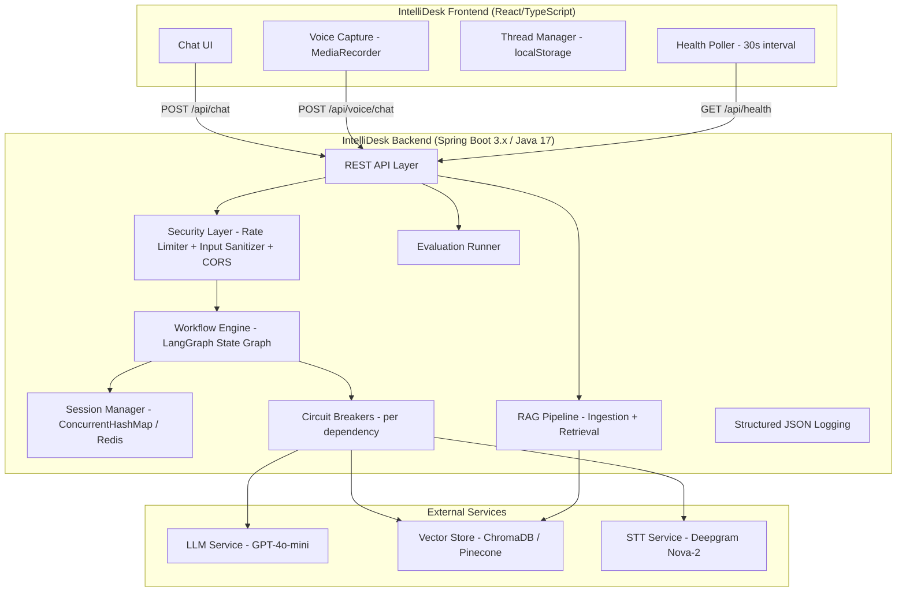
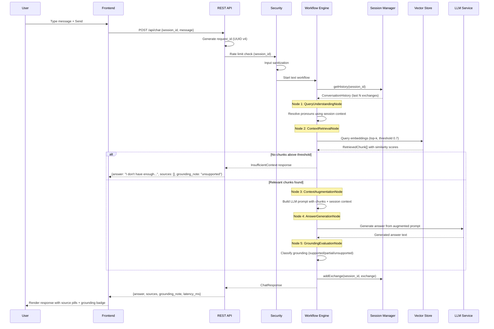
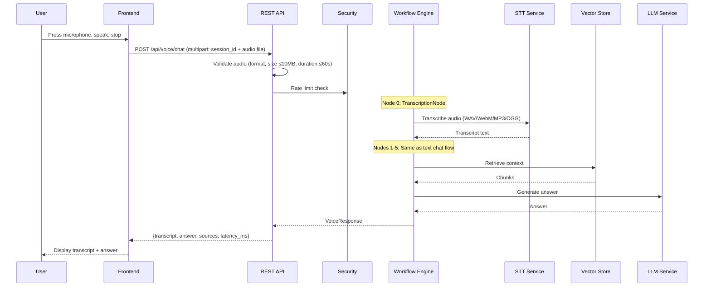
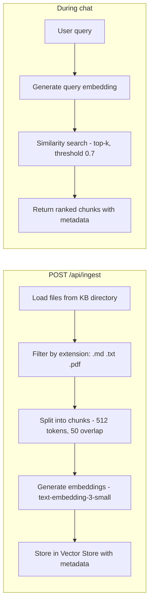
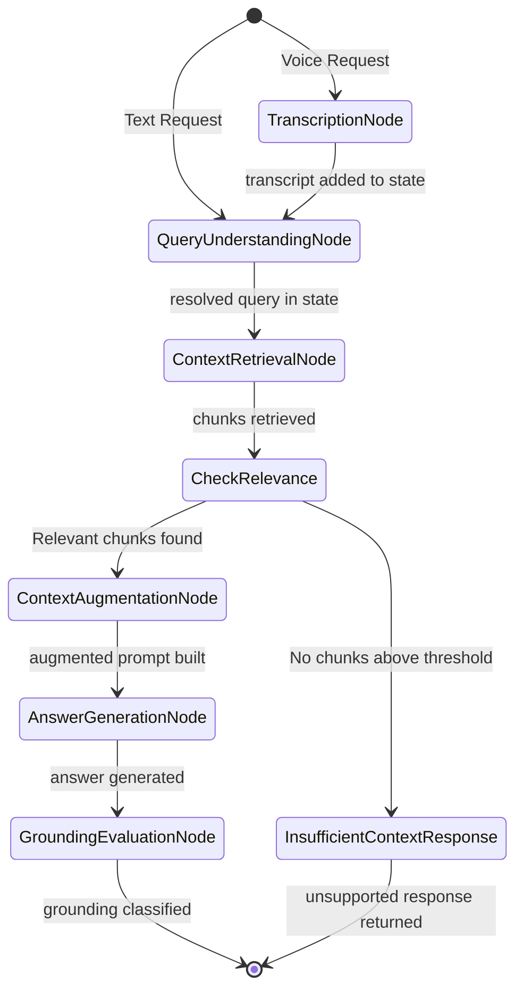
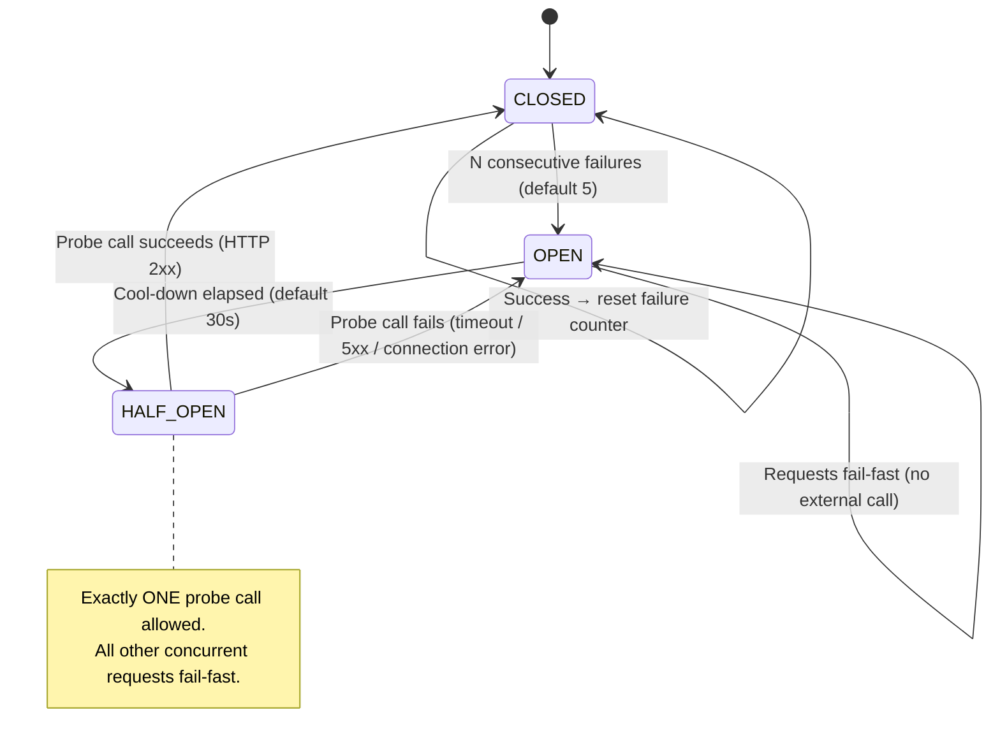

# IntelliDesk Architecture

This document describes the architecture of IntelliDesk, an AI-powered IT Support Knowledge Assistant. It covers system flows, integration points, design tradeoffs, and the LangGraph-style workflow orchestration.

## Table of Contents

- [System Overview](#system-overview)
- [High-Level Architecture](#high-level-architecture)
- [Data Flows](#data-flows)
  - [Text Chat Flow](#text-chat-flow)
  - [Voice Chat Flow](#voice-chat-flow)
  - [Document Retrieval Flow](#document-retrieval-flow)
- [LangGraph Workflow State Machine](#langgraph-workflow-state-machine)
  - [Nodes](#nodes)
  - [Edges and Conditions](#edges-and-conditions)
  - [State Object](#state-object)
- [Integration Points](#integration-points)
  - [LLM Service](#llm-service)
  - [Vector Store](#vector-store)
  - [STT Service](#stt-service)
- [Technology Choices and Rationale](#technology-choices-and-rationale)
  - [Embedding Model](#embedding-model)
  - [Large Language Model](#large-language-model)
  - [Vector Store](#vector-store-choice)
- [Session Management Strategy](#session-management-strategy)
- [Error Handling Strategy](#error-handling-strategy)
- [Resilience Patterns](#resilience-patterns)
- [Design Tradeoffs](#design-tradeoffs)

---

## System Overview

IntelliDesk combines a React/TypeScript frontend with a Java Spring Boot backend that orchestrates a Retrieval-Augmented Generation (RAG) pipeline through a LangGraph-style directed workflow graph. The system retrieves relevant knowledge chunks from a vector store, generates source-grounded answers via an LLM, and supports voice input through speech-to-text transcription.

---

## High-Level Architecture



---

## Data Flows

### Text Chat Flow

The text chat flow processes a user's text message through the RAG pipeline to produce a source-grounded answer.



**Processing stages:**

| Stage | Input | Output | Service Invoked |
|-------|-------|--------|-----------------|
| Request Validation | Raw HTTP request | Validated ChatRequest | None |
| Rate Limiting | session_id | Pass/Reject (429) | None |
| Input Sanitization | Raw message text | Cleaned message | None |
| Query Understanding | Message + session history | Resolved query | None (rule-based) |
| Context Retrieval | Resolved query | RetrievedChunk[] | Vector Store |
| Context Augmentation | Chunks + session context | Augmented prompt | None |
| Answer Generation | Augmented prompt | Generated answer | LLM Service |
| Grounding Evaluation | Answer + chunks | Grounding classification | None (rule-based) |

### Voice Chat Flow

The voice flow extends the text chat flow by prepending an audio transcription step.



**Processing stages (voice-specific):**

| Stage | Input | Output | Service Invoked |
|-------|-------|--------|-----------------|
| Audio Validation | Multipart upload | Validated audio file | None |
| Transcription | Audio bytes (WAV/WebM/MP3/OGG) | Transcript string | STT Service (Deepgram) |
| _Remaining stages_ | _Same as text chat flow_ | | |

### Document Retrieval Flow

The ingestion pipeline converts documents into searchable vector embeddings.



**Ingestion details:**
- Source directory: Configured via environment variable (default `data/knowledge-base/`)
- Supported formats: `.md`, `.txt`, `.pdf` (max 50MB each)
- Chunking: Configurable token size (default 512) with overlap (default 50)
- Re-ingestion: Old chunks for the same file path are replaced (no duplicates)
- Error tolerance: Failed files are skipped; successful files continue processing

**Retrieval details:**
- Query embedding generated using same model as ingestion (text-embedding-3-small)
- Top-k results returned (default k=5)
- Similarity threshold applied (default 0.7); chunks below are discarded
- Each chunk carries metadata: file_name, file_path, file_type, ingestion_timestamp, section_title

---

## LangGraph Workflow State Machine

The backend implements a LangGraph4j-style directed state graph where each node is a pure function transforming a shared `WorkflowState` object.

### State Machine Diagram



### Nodes

| Node | Responsibility | Input (from state) | Output (added to state) | External Service |
|------|---------------|-------------------|------------------------|------------------|
| `TranscriptionNode` | Transcribe audio to text | Audio bytes | `transcript` (String) | STT Service via Circuit Breaker |
| `QueryUnderstandingNode` | Resolve pronouns/references using session context | `originalQuery`, `sessionContext` | `resolvedQuery` (String) | None |
| `ContextRetrievalNode` | Find semantically relevant knowledge chunks | `resolvedQuery` | `retrievedChunks` (List\<RetrievedChunk\>) | Vector Store via Circuit Breaker |
| `ContextAugmentationNode` | Construct LLM prompt with retrieved context + history | `retrievedChunks`, `sessionContext`, `resolvedQuery` | `augmentedPrompt` (String) | None |
| `AnswerGenerationNode` | Generate a grounded answer from the prompt | `augmentedPrompt` | `generatedAnswer` (String) | LLM Service via Circuit Breaker |
| `GroundingEvaluationNode` | Classify how well the answer is grounded in sources | `generatedAnswer`, `retrievedChunks` | `groundingResult` (GroundingResult) | None |

### Edges and Conditions

| From | To | Condition |
|------|----|-----------|
| Start | `TranscriptionNode` | Request is voice (audio present) |
| Start | `QueryUnderstandingNode` | Request is text (no audio) |
| `TranscriptionNode` | `QueryUnderstandingNode` | Always (unconditional) |
| `QueryUnderstandingNode` | `ContextRetrievalNode` | Always (unconditional) |
| `ContextRetrievalNode` | `ContextAugmentationNode` | At least one chunk has similarity ≥ threshold |
| `ContextRetrievalNode` | `InsufficientContextResponse` | **All chunks below threshold** (conditional edge) |
| `ContextAugmentationNode` | `AnswerGenerationNode` | Always (unconditional) |
| `AnswerGenerationNode` | `GroundingEvaluationNode` | Always (unconditional) |
| `GroundingEvaluationNode` | End | Always (unconditional) |

### State Object

```java
public record WorkflowState(
    String originalQuery,       // Raw user input (text or transcript)
    String sessionId,           // UUID identifying the session
    String requestId,           // UUID for request correlation
    List<ConversationExchange> sessionContext,  // Recent conversation history
    List<RetrievedChunk> retrievedChunks,       // Chunks from vector store
    String augmentedPrompt,     // Constructed LLM prompt
    String generatedAnswer,     // LLM response text
    GroundingResult groundingResult,  // Classification result
    Map<String, Object> metadata     // Extensible metadata bag
)
```

Each node receives the complete accumulated state from all prior nodes and appends its output fields. The state is immutable between nodes — each node produces a new state instance.

### Node Failure Behavior

- If any node throws an exception or exceeds its timeout (default 30s), the workflow **halts immediately**
- No subsequent nodes execute
- An error response is returned containing: `error`, `failed_node`, and `request_id`
- The failure is logged at ERROR level with node name, duration, and error detail

---

## Integration Points

### LLM Service

| Aspect | Detail |
|--------|--------|
| Provider | OpenAI (default GPT-4o-mini) |
| Protocol | HTTPS REST API |
| Auth | API key via environment variable `OPENAI_API_KEY` |
| Circuit Breaker | Yes — independent instance |
| Timeout | 30 seconds (configurable) |
| Failure threshold | 5 consecutive failures → circuit opens |
| Cool-down | 30 seconds before half-open probe |
| Degraded mode | Returns raw retrieved chunks without synthesis (grounding_note: "raw retrieval mode") |
| Invoked by | `AnswerGenerationNode`, `QueryUnderstandingNode` (for pronoun resolution) |

### Vector Store

| Aspect | Detail |
|--------|--------|
| Provider | ChromaDB (local) / Pinecone (production) |
| Protocol | HTTP REST API (ChromaDB) / gRPC+HTTPS (Pinecone) |
| Auth | API key via environment variable `VECTOR_STORE_API_KEY` |
| Circuit Breaker | Yes — independent instance |
| Timeout | 5 seconds per query (configurable) |
| Failure threshold | 5 consecutive failures → circuit opens |
| Cool-down | 30 seconds before half-open probe |
| Degraded mode | HTTP 503 on all retrieval-dependent endpoints |
| Invoked by | `ContextRetrievalNode` (query), `DocumentIngester` (upsert) |

### STT Service

| Aspect | Detail |
|--------|--------|
| Provider | Deepgram Nova-2 |
| Protocol | HTTPS REST API |
| Auth | API key via environment variable `STT_API_KEY` |
| Circuit Breaker | Yes — independent instance |
| Timeout | 30 seconds (configurable) |
| Failure threshold | 5 consecutive failures → circuit opens |
| Cool-down | 30 seconds before half-open probe |
| Degraded mode | Voice endpoint returns HTTP 503; text chat unaffected |
| Supported formats | WAV, WebM, MP3, OGG |
| Max audio size | 10 MB |
| Max duration | 60 seconds |
| Invoked by | `TranscriptionNode` |

---

## Technology Choices and Rationale

### Embedding Model

| Criterion | Decision |
|-----------|----------|
| **Selected** | OpenAI `text-embedding-3-small` |
| **Alternatives considered** | OpenAI `text-embedding-3-large`, Cohere `embed-english-v3.0`, open-source `all-MiniLM-L6-v2` (Sentence Transformers) |
| **Selection criteria** | Quality-to-cost ratio, dimension count vs. storage cost, API availability, compatibility with vector store |
| **Rationale** | `text-embedding-3-small` produces 1536-dimensional vectors with strong semantic quality at significantly lower cost than the large variant. Unlike open-source models, it requires no GPU infrastructure for inference. Its vectors are well-supported by both ChromaDB and Pinecone. The quality is sufficient for IT support domain retrieval where queries and documents share technical vocabulary. |

### Large Language Model

| Criterion | Decision |
|-----------|----------|
| **Selected** | OpenAI `GPT-4o-mini` (configurable) |
| **Alternatives considered** | GPT-4o (full), Claude 3.5 Sonnet, Llama 3 (self-hosted), Mistral Large |
| **Selection criteria** | Instruction-following quality for grounded answers, cost per token, latency, context window size, API reliability |
| **Rationale** | GPT-4o-mini offers strong instruction following at a fraction of GPT-4o's cost. For IT support Q&A with retrieved context, it reliably produces grounded answers without hallucination when properly prompted. Its 128K context window accommodates large session histories and multiple retrieved chunks. Self-hosted alternatives (Llama 3) were rejected due to infrastructure complexity for an MVP. The model is configurable so it can be swapped for production scaling. |

### Vector Store Choice

| Criterion | Decision |
|-----------|----------|
| **Selected** | ChromaDB (local development) / Pinecone (production) |
| **Alternatives considered** | Weaviate, Milvus, pgvector (PostgreSQL), Qdrant |
| **Selection criteria** | Zero-config local development, managed production scalability, metadata filtering, API simplicity, cost |
| **Rationale** | ChromaDB provides zero-config local development — no separate database process required, runs embedded in the JVM test suite. This enables out-of-the-box development after `git clone`. Pinecone for production offers fully managed infrastructure, automatic scaling, and high availability without operational burden. The abstraction layer (`ChunkRetriever` interface) allows swapping implementations without code changes. pgvector was considered but rejected due to requiring PostgreSQL setup for local dev, adding operational complexity to the MVP. |

---

## Session Management Strategy

### How Sessions Are Identified

- Each session is identified by a UUID v4 `session_id` provided by the client
- The frontend generates a new `session_id` when the user creates a new conversation thread
- All messages in a thread share the same `session_id`

### Conversation Context Window

- The backend retains the most recent **N exchanges** per session (configurable, default 10, min 1, max 50)
- One exchange = one user message + one assistant response
- When the window is exceeded, the oldest exchanges are discarded (FIFO)
- The retained context is passed to `QueryUnderstandingNode` for pronoun resolution and to `ContextAugmentationNode` for LLM prompt construction

### Session Expiration Policy

- Sessions expire after a configurable timeout of inactivity (default 30 minutes, min 1 min, max 1440 min)
- "Inactivity" means no new messages received for the session
- Expired sessions have their conversation history released from memory
- If a message arrives for an expired session, a new empty context is created and the response includes an indicator that prior context is no longer available

### Maximum History Retained

- Per session: up to N exchanges (configurable window size, default 10)
- Total sessions: unbounded in-memory (local); bounded by Redis memory in production
- Storage format: `ConcurrentHashMap<String, ConversationHistory>` (local) or Redis key-value with TTL (production)

### Storage Strategy

| Environment | Storage | TTL Mechanism | Thread Safety |
|-------------|---------|---------------|---------------|
| Local | `ConcurrentHashMap` | Scheduled cleanup task | Built-in CAS operations |
| Production | Redis | Native key TTL | Redis single-threaded model |

---

## Error Handling Strategy

### Principles

1. **Consistent response format**: All errors return a JSON object with `error`, `status`, `request_id`, and `timestamp`
2. **Correlation**: Every error includes the `request_id` for tracing across logs
3. **Specificity**: Error messages are descriptive enough for debugging without exposing internals
4. **Fail-fast**: Invalid requests are rejected at the API boundary before reaching the workflow
5. **Graceful degradation**: External service failures produce degraded responses rather than hard errors where possible

### Error Categories and HTTP Status Codes

| HTTP Status | Category | Trigger Scenarios |
|-------------|----------|-------------------|
| 400 | Validation Error | Empty/whitespace message, invalid session_id format, message exceeds max length, invalid chunk config, pure prompt injection, invalid file name |
| 401 | Authentication | Missing or expired session on voice endpoint |
| 403 | Forbidden | CORS violation (non-allowed origin) |
| 404 | Not Found | Empty/missing knowledge base directory, missing evaluation dataset |
| 409 | Conflict | Concurrent ingestion attempt, evaluation before ingestion, concurrent evaluation |
| 413 | Payload Too Large | Audio file > 10MB, audio duration > 60s |
| 415 | Unsupported Media Type | Audio format not in {WAV, WebM, MP3, OGG} |
| 422 | Unprocessable Entity | STT transcription failure |
| 429 | Rate Limited | Exceeded requests/minute per session (sliding window) |
| 500 | Internal Server Error | Workflow node failure, unexpected exception, health check internal error |
| 503 | Service Unavailable | LLM/Vector Store/STT unavailable (circuit breaker open) |
| 504 | Gateway Timeout | Evaluation timeout exceeded |

### Error Response Structure

```json
{
  "error": "Human-readable error description",
  "status": 400,
  "request_id": "550e8400-e29b-41d4-a716-446655440000",
  "timestamp": "2024-01-15T10:30:00.123Z"
}
```

For workflow failures, additional fields:
```json
{
  "error": "Workflow node timed out after 30 seconds",
  "status": 500,
  "request_id": "550e8400-e29b-41d4-a716-446655440000",
  "failed_node": "AnswerGenerationNode",
  "timestamp": "2024-01-15T10:30:00.123Z"
}
```

### Error Logging

All errors are logged at ERROR level with structured JSON containing:
- `request_id` and `session_id` for correlation
- `timestamp` in ISO 8601 UTC with millisecond precision
- Error type, message, and context-specific fields
- Stack trace for unexpected (5xx) errors only

---

## Resilience Patterns

### Circuit Breaker State Machine

Each external service (LLM, Vector Store, STT) has its own circuit breaker instance.



### Graceful Degradation Matrix

| Service Down | Impact on Voice | Impact on Text Chat | Response Behavior |
|--------------|----------------|--------------------|--------------------|
| STT Service | ❌ Disabled (503) | ✅ Unaffected | Voice endpoint returns 503; text works normally |
| LLM Service | ⚠️ Degraded | ⚠️ Degraded | Returns raw retrieved chunks in answer field; grounding_note = "raw retrieval mode" |
| Vector Store | ❌ Disabled (503) | ❌ Disabled (503) | All retrieval-dependent endpoints return 503 |

### Timeout Strategy

| Component | Default Timeout | Configurable |
|-----------|----------------|--------------|
| Per workflow node | 30 seconds | Yes |
| LLM API call | 30 seconds | Yes |
| Vector Store query | 5 seconds | Yes |
| STT transcription | 30 seconds | Yes |
| Health check per-dependency | 5 seconds | Yes (1-30s) |
| Overall health check | 10 seconds | No |
| Evaluation run | 120 seconds | Yes |
| Rate limit window | 60 seconds (sliding) | Fixed |

---

## Design Tradeoffs

### 1. LangGraph-style State Graph vs. Simple Sequential Pipeline

**Chosen:** LangGraph-style directed graph with explicit nodes, edges, and conditions.

**Tradeoff:** More complex infrastructure upfront, but gains visibility, testability, and extensibility. Each node is independently testable with a clear contract (State → State). Conditional edges make control flow explicit. New nodes (e.g., content filtering, PII detection) can be inserted without restructuring.

**Rejected alternative:** A simple chain of service method calls would be faster to implement but hides control flow, makes conditional branching implicit, and complicates observability.

### 2. In-Memory Sessions (Local) vs. Redis (Production)

**Chosen:** Dual strategy — `ConcurrentHashMap` locally, Redis in production.

**Tradeoff:** Simplifies local development (no Redis required) at the cost of no horizontal scaling locally. The `SessionManager` interface abstracts the storage backend, so the implementation can be swapped via Spring profile without code changes.

### 3. ChromaDB (Local) + Pinecone (Production) vs. Single Vector Store

**Chosen:** Environment-specific vector stores behind the `ChunkRetriever` interface.

**Tradeoff:** Two implementations to maintain, but developers can run the full system locally without cloud credentials or docker-compose for a vector database. Production gets managed, auto-scaling infrastructure without operational burden.

### 4. Grounding Evaluation as Separate Node vs. Inline in Answer Generation

**Chosen:** Separate `GroundingEvaluationNode` after answer generation.

**Tradeoff:** Adds an additional processing step and slight latency, but cleanly separates concerns. The grounding classification logic can be improved or replaced independently from the answer generation prompt. This also enables different grounding strategies (LLM-based, rule-based, or hybrid) without touching the generation node.

### 5. Fail-Fast on Workflow Node Failure vs. Partial Response

**Chosen:** Halt workflow immediately on any node failure.

**Tradeoff:** Users get no partial answer when an intermediate step fails, but the system never returns misleading or ungrounded content. The error response includes the failed node name for debugging. Graceful degradation at the service level (circuit breakers) handles predictable failure modes; unexpected per-request failures halt cleanly.

### 6. Per-Session Rate Limiting vs. IP-Based or Global

**Chosen:** Sliding window rate limiting per `session_id`.

**Tradeoff:** Simple to implement and correlates with user activity. However, it doesn't prevent abuse from clients generating many session IDs. Acceptable for an internal IT support tool where sessions map to authenticated users. A production hardening pass could layer IP-based or token-based limits on top.

### 7. Synchronous REST vs. Streaming (SSE/WebSocket)

**Chosen:** Synchronous request/response for MVP.

**Tradeoff:** Users wait for the complete answer before seeing any content. This simplifies the implementation (no streaming state management, simpler error handling) but increases perceived latency. The architecture supports a future migration to Server-Sent Events for token-by-token streaming without fundamental restructuring — the workflow engine would emit partial state updates.
